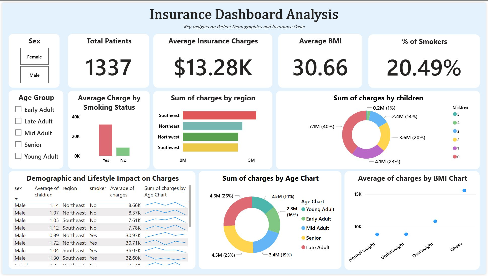

# Healthcare Insurance Analysis

## Table of Contents

- [Project Overview](#project-overview)
- [Data Sources](#data-sources)
- [Data Analysis](#data-analysis)
- [Findings](#findings)
- [Recommendations](#recommendations)

### Project Overview
This data analysis project explored a fictional insurance dataset using Excel for data cleaning, preparation, and analysis, followed by Power BI for creating an interactive dashboard. The goal was to identify trends in patient demographics, lifestyle factors, and their impact on medical charges. Key variables analyzed include age group, BMI category, smoking status, region, and number of children.

To simulate a real-world business scenario, I collaborated with ChatGPT acting as both a Product Manager and a Stakeholder to define objectives, KPIs, and reporting requirements. The entire process—from raw data to final dashboard—was completed without following YouTube tutorials, showcasing my independent problem-solving skills and ability to deliver a data project from start to finish. This project highlights my proficiency in both Excel analysis and Power BI visualization.

### Data Sources
insurance.xlsm – The primary dataset used in this project contains detailed patient records, including demographic information (age, sex, region), lifestyle factors (smoking status, BMI), family size (number of children), and medical charges. This data was used to explore relationships between these factors, as well as insurance costs, uncovering potential trends and cost drivers.

### Tools
Microsoft Excel – Performed initial data inspection, formatting, and cleanup of the insurance dataset, including creating calculated fields for analysis.

Power BI – Designed an interactive dashboard to visualize key metrics, track KPIs, and uncover trends in patient demographics, smoking habits, and charges.

Simulated Stakeholder Collaboration – Defined business goals, KPIs, and project requirements through a guided real world style workflow.

### Data Cleaning / Preparation

During the data preparation phase, I performed several steps to ensure the dataset was accurate, consistent, and ready for visualization:

1. Removed Unnecessary Columns
   Deleted extra or unused fields from the dataset to keep only relevant columns such as age, sex, bmi, children, smoker, region, and charges.

2. Standardized Categorical Values
   Reformatted sex, smoker, and region fields so values were consistently capitalized (e.g., male → Male, northwest → Northwest).

3. Created Age Group Categories
   Added a new calculated column to categorize patients into meaningful age brackets for analysis:
   - Young Adult
   - Early Adult
   - Mid Adult
   - Late Adult
   - Senior

4. Validated Data Consistency
   Found and removed duplicate records to ensure each patient record was unique. No blank or null values were present in the dataset.

5. Imported into Power BI and Created Measures
   Loaded the cleaned Excel file into Power BI and used DAX to create custom measures such as % of Smokers and average charges, enabling interactive filtering in the dashboard.

These steps ensured the dataset was accurate, consistent, and ready for visualization.

### Exploratory Data Analysis

During the EDA phase, I explored the dataset to uncover initial patterns and areas worth deeper investigation:

- Noticed that smokers tend to have significantly higher insurance charges compared to non-smokers.
- Found that certain regions, particularly the Southeast, have a higher concentration of smokers.
- Observed that older adults generally have higher average charges, especially those with higher BMI values.
- Detected small variations in average charges between males and females, but no major imbalance in gender distribution.
- Identified a relatively even spread of patients across regions, with slight differences in average charges per region.
- These findings helped guide which KPIs to focus on during the formal analysis stage.
- These KPIs were selected to help stakeholders identify demographic trends, evaluate the financial impact of lifestyle factors like smoking, and assess regional differences in healthcare costs.

### Data Analysis

Once KPIs were defined, I calculated them in Excel and visualized them in Power BI for interactive filtering:

- Total Patients: 1,338 individuals in the dataset.
- Percentage of Smokers: 20.4% of patients identified as smokers.
- Average Charges: $13,500 USD per patient across the dataset.
- Charges by Age Group: Seniors accounted for 25% of total charges despite representing a smaller portion of patients.
- Charges by Region: The Southeast region had the highest average charges at $14,200.
- Children per Family: Average of 1.09 children per patient household.

All metrics were linked to slicers and filters to allow users to view variations by gender, age group, smoking status, and region.

### Findings

- Smokers carry a significant cost burden — On average, smokers had substantially higher insurance charges compared to non-smokers, with the gap most pronounced in older age groups.
- Age strongly correlates with charges — Seniors and late adults accounted for a disproportionately large share of total charges, even though they represent a smaller portion of the insured population.
- Regional variations are notable — The Southeast had the highest average charges, suggesting potential lifestyle, demographic, or healthcare cost differences.
- Gender distribution is balanced — Males and females were nearly evenly represented in the dataset, with only minor differences in average charges.
- Family size has limited impact on charges — Average number of children per household showed minimal influence on total charges, though larger families did not significantly reduce per-person costs.
- BMI is a potential cost driver — Higher BMI categories generally corresponded with higher charges, especially when combined with smoking status.
- Smoking prevalence differs across regions — Some regions have a noticeably higher percentage of smokers, which could influence targeted health campaigns or regional policy changes.
- Charge variability is highest among smokers — In addition to higher average costs, smokers had a wider range of charges, suggesting more unpredictable healthcare expenses.

### Recommendations
Based on the analysis, I recommend the following actions:

- Develop targeted outreach for high-cost patient segments
  Smokers consistently incur higher charges than non-smokers. Implementing preventative care programs, smoking cessation support, and targeted health campaigns could help reduce long-term costs.

- Tailor healthcare plans by demographic group
  Certain age groups, such as mid to late adults, show higher average charges. Offering age-specific wellness programs or cost-sharing options could improve patient health outcomes and reduce claims.

- Address regional cost disparities
  Some regions display noticeably higher average charges. Further investigation into regional healthcare access, pricing structures, and local risk factors can help inform cost control strategies.

- Encourage family-focused health benefits
  Patients with more children tend to have slightly higher charges. Family-oriented wellness initiatives and preventative care packages could mitigate these costs over time.

- Continue tracking smoking status trends
  Given the significant cost gap between smokers and non-smokers, ongoing monitoring will help measure the effectiveness of any health initiatives aimed at reducing smoking rates.

### References
1. Data
   - [Files]([https://drive.google.com/drive/folders/1mg8zaCAVh-yzbEcX710vZ5NvzlF-xV6b](https://www.kaggle.com/datasets/willianoliveiragibin/healthcare-insurance))

